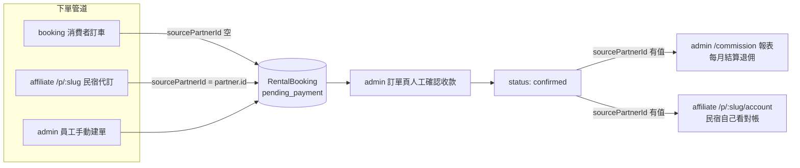

# 架構總覽

給第一次接觸這個 repo 的協作同事看。這份文件回答三個問題：這個系統有哪些網站、
它們怎麼分工、資料怎麼流動。細節見同資料夾的其他文件：

- [`01-apps.md`](./01-apps.md) — 每個 app 對應誰在用、有哪些頁面
- [`02-libs.md`](./02-libs.md) — `libs/` 底下共用了什麼、被誰用
- [`03-pricing-and-commission.md`](./03-pricing-and-commission.md) — 定價與退佣的業務邏輯公式

## 這是什麼系統

澎湖租車行的管理系統。核心概念：車行有自己的車隊，透過**三個管道**把車租出去——
車行員工在後台直接操作、消費者自己上網訂、合作民宿幫住客代訂。三個管道最終都變成
同一種資料（`RentalBooking` 訂單），只是「誰下的單」不同，這個差異用
`RentalBooking.sourcePartnerId` 這個欄位標記（見 `libs/domain/src/lib/models/rental-booking.ts`）。

## Nx Monorepo 結構

```
apps/
  admin/       # 車行內部後台（員工用）
  booking/     # 消費者訂車站（一般旅客用，免登入）
  affiliate/   # 民宿代訂＋對帳站（合作民宿用，免登入）
  pos/         # 目前是 Nx 預設腳手架，尚未開發任何功能，先忽略

libs/
  domain/         # 全系統共用的 model、Repository 介面、定價/退佣純函式、seed 資料
  booking-flow/   # 五步預約流程元件 + CatalogStore，booking 和 affiliate 都用它
  theme-pack/     # 雙軸主題系統（範式 × 配色），目前只有 admin 套用
```

三個 app 是**三個獨立部署的網站**（各自的 port，未來各自的網域），不是同一站底下的分頁。
為什麼要分開部署，詳見根目錄 `README.md`「為什麼設計成不同 App」一節。

## 各 app 對應的業務角色

| App | 對應業務角色 | 免登入 | 套 theme-pack |
|---|---|---|---|
| `admin` | 車行員工（後台管理、退佣結算） | 否 | 是 |
| `booking` | 一般消費者（自助訂車） | 是 | 否 |
| `affiliate` | 合作民宿（幫住客代訂、看自己的對帳單） | 是 | 否 |
| `pos` | 尚未開發 | — | — |

## 資料流（一筆訂單的生命週期）



三個下單管道底層共用同一個 `libs/booking-flow`（見 `02-libs.md`），差別只在
`FlowMode`（`consumer` vs `partner`）：partner 模式會套民宿的協議折扣、
訂單多記一個 `sourcePartnerId`。

## 已知限制：目前是純前端 mock，三站資料不互通

沒有真後端，資料存在瀏覽器的 `localStorage`（key 前綴 `cr.`，見 `02-libs.md` 的
Repository 章節）。三個 app 是三個不同 origin（不同 port），**localStorage 各自獨立**：

- 在 `booking` 下的單不會出現在 `admin` 的訂單列表。
- 在 `affiliate` 下的單不會即時出現在 `admin` 的退佣報表。
- 每個 app 第一次開啟時會各自載入自己的 seed 資料（見 `libs/domain/src/lib/repositories/seed-data.ts`），
  所以 demo 時三個站各自看起來都有資料，但那是各自的 seed，不是同一批。

接上真後端（把 `LocalStorageRepository` 換成打 API 的實作）之後，三站才會即時共享同一份資料。
這是目前架構刻意換取的簡化（純前端、零後端依賴），不是疏漏。
